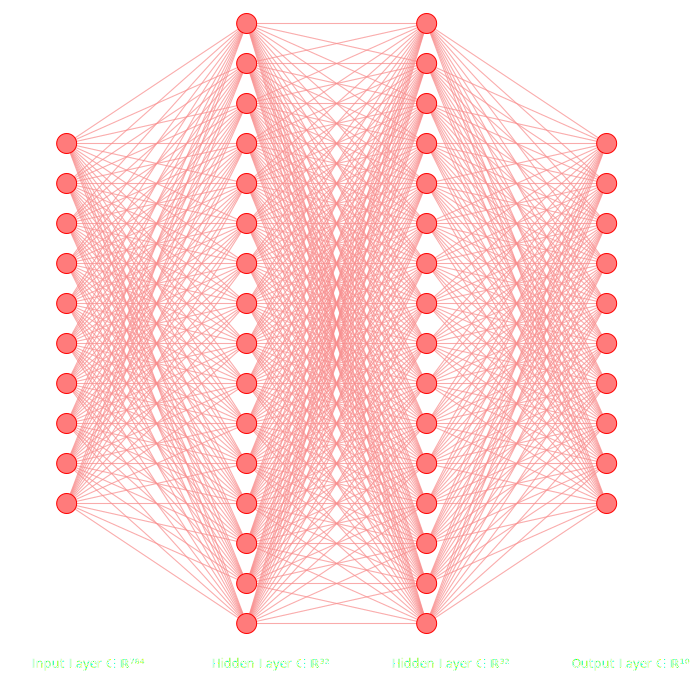
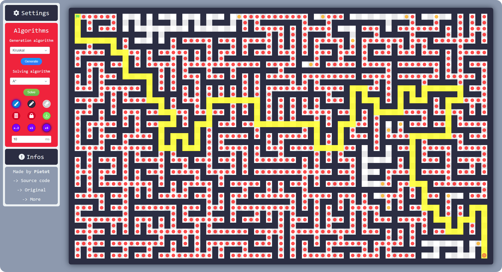

## 👋 Hello everyone ! My name is Baptiste. Here's more informations:

# 🚀 About Me

I am a French developer passionate about artificial intelligence and big data. I love creating my own projects and working on innovative projects. Here’s a bit more about me:

- 🖥️ I'm currently working on my own Connect 4 AI to play perfectly.
- 🌱 I’m also learning Go, AI and machine learning algorithms/models.
- 💬 Feel free to reach out to me for questions or collaborations on what you think I can do.
- 📫 You can reach me at baptiste.blasquez@gmail.com or by adding me on discord (username: pietot).
- ⚡ Random facts: I listen to electronic musics, my favorite game all time is Mario Galaxy and I love Professor Layton serie.

---

# 📫 Contacts

	
	&nbsp;
	
	&nbsp;
	

---

# 🛠️ Languages and Tools

	
	
	
	
	  
	
	
	

---

# 📈 GitHub Stats

    
      
    
      
    

# 📂 My best Projects

## [🧠 Handwritten Digits Recognition _(2025)_](https://github.com/Pietot/MNIST-Neural-Network)

A Python Neural Network built from scratch and Pytorch capable of recognizing handwritten digits from the MNIST dataset.

    

## [📌 Maze Maker Solver _(2024)_](https://github.com/Pietot/Maze-Maker-Solver)

An interactive online maze generator and solver able to use several different algorithms.

## [🌀 Lapyrinth _(2024)_](https://github.com/Pietot/Lapyrinth)

A program capable of creating mazes with many different algorithms and solving them with different pathfinders.

## [🐛 Pokedex _(2024)_](https://github.com/Pietot/Pokedex)

French online pokedex with all the pokemons from the first generation to the last one using external APIs. You can search for a pokemon by its name or its number and see all its informations. You can also filter the pokemons by their types an generation.

---

Thank you for visiting my profile! Feel free to explore my projects and contact me for any collaborations. 😊
